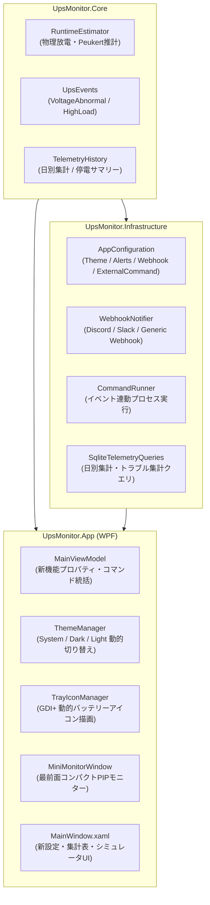

# 包括的機能改善 (Feature Enhancements) 実装完了レポート (Walkthrough)

## 1. 概要

PowerGuard (CyberPowerMon) に対し、ユーザーからの要望に基づき以下の4大カテゴリにわたる包括的な機能改善と新機能の実装を完了しました。

1. **タスクトレイ・通知・アラートの強化**
   - バッテリー残量・充電・電源状態をリアルタイムに色とゲージ・数値で描画する動的タスクトレイアイコン
   - 設定画面からのワンクリック通知テスト機能
   - 高負荷警告（%）・電圧異常（低電圧サグ/高電圧サージ）のカスタム閾値判定とシステム音声アラート
2. **テーマ切り替え ＆ デスクトップ常駐ミニモニター (UI/UX 強化)**
   - システム設定追従 / ダークモード / ライトモードの手動切り替えと即時適用
   - デスクトップ常時最前面 (Topmost) で半透明・ドラッグ移動可能なコンパクト PIP ミニモニター
3. **電力・電気代・停電の統計分析レポート ＆ 負荷別ランタイム推計シミュレータ**
   - 過去7日間の日別消費電力量 (kWh)、推定電気代 (円)、ピーク/平均電力、停電回数の集計 DataGrid
   - 選択期間内の停電回数・累積停電時間、電圧サグ・サージ発生件数のトラブルサマリー
   - Peukert の法則と物理定電力放電モデルに基づく、任意負荷 (W) での残り稼働可能時間推計シミュレータと標準負荷一覧表
4. **外部通知 (Webhook) ＆ 自動化スクリプト実行**
   - Discord (リッチ埋め込み / 状態別カラー)、Slack、汎用 JSON Webhook へのイベント非同期 POST 送信
   - 停電、復電、バッテリー低下、過負荷などのイベントに応じた外部コマンド・バッチファイルの非同期自動実行

---

## 2. 実装された機能詳細とアーキテクチャ



### 2.1 Core レイヤー
- [`UpsMonitor.Core/RuntimeEstimator.cs`](file:///C:/Users/geranium/orca/workspaces/cyberpowermon/clownfish/UpsMonitor.Core/RuntimeEstimator.cs):
  - 物理バッテリー定電力放電モデル（$P_{bat} = \frac{P_{load}}{\eta}$、Peukert 係数 $k=1.15$ による大電流放電損失補正）を実装。
  - 実測ランタイム基準点が記録されている場合は、その基準点に基づき非線形推計を行う高精度モードを搭載。
- [`UpsMonitor.Core/UpsEvents.cs`](file:///C:/Users/geranium/orca/workspaces/cyberpowermon/clownfish/UpsMonitor.Core/UpsEvents.cs):
  - `VoltageAbnormal`, `HighLoadWarning` イベント種別を追加し、`UpsEventSeverity.Warning` にマッピング。
- [`UpsMonitor.Core/TelemetryHistory.cs`](file:///C:/Users/geranium/orca/workspaces/cyberpowermon/clownfish/UpsMonitor.Core/TelemetryHistory.cs):
  - `DailyEnergyReportItem`（日別消費電力量・電気代・停電数）および `PowerTroubleSummary`（停電・サグ・サージ統計）データ構造を追加。

### 2.2 Infrastructure レイヤー
- [`UpsMonitor.Infrastructure/AppConfiguration.cs`](file:///C:/Users/geranium/orca/workspaces/cyberpowermon/clownfish/UpsMonitor.Infrastructure/AppConfiguration.cs):
  - `UiConfiguration.Theme` ("system", "dark", "light")、`AlertsConfiguration`、`WebhookConfiguration`、`ExternalCommandConfiguration` を追加。
- [`UpsMonitor.Infrastructure/WebhookNotifier.cs`](file:///C:/Users/geranium/orca/workspaces/cyberpowermon/clownfish/UpsMonitor.Infrastructure/WebhookNotifier.cs):
  - Discord の Embeds 形式、Slack の JSON 形式、汎用 Webhook に対応した非同期 HTTP 送信サービス。ワンクリック送信テスト機能付き。
- [`UpsMonitor.Infrastructure/CommandRunner.cs`](file:///C:/Users/geranium/orca/workspaces/cyberpowermon/clownfish/UpsMonitor.Infrastructure/CommandRunner.cs):
  - プレースホルダー（`{EVENT}`, `{SEVERITY}`, `{STATE}`, `{BATTERY}`, `{RUNTIME}`, `{POWER}`, `{MESSAGE}`）をリアルタイム値に置換して外部コマンドやバッチを実行。
- [`UpsMonitor.Infrastructure/SqliteTelemetryQueries.cs`](file:///C:/Users/geranium/orca/workspaces/cyberpowermon/clownfish/UpsMonitor.Infrastructure/SqliteTelemetryQueries.cs):
  - `QueryDailyEnergyReportsAsync`: 過去 N 日間の日別消費電力量 (kWh)、設定電気料金単価に基づく推定電気代、ピーク/平均電力、停電回数を集計。
  - `QueryPowerTroubleSummaryAsync`: 指定期間内の商用電源断（停電）回数・累積時間、および設定電圧閾値に基づく電圧低下（サグ）・電圧上昇（サージ）回数を集計。

### 2.3 App (UI / UX / タスクトレイ) レイヤー
- [`UpsMonitor.App/ThemeManager.cs`](file:///C:/Users/geranium/orca/workspaces/cyberpowermon/clownfish/UpsMonitor.App/ThemeManager.cs):
  - システムのレジストリ (`AppsUseLightTheme`) を追従するモードに加え、ダークテーマ / ライトテーマへの明示的な切り替えとリソース辞書の動的差し替えを実装。
- [`UpsMonitor.App/TrayIconManager.cs`](file:///C:/Users/geranium/orca/workspaces/cyberpowermon/clownfish/UpsMonitor.App/TrayIconManager.cs):
  - GDI+ による16x16動的バッテリーアイコン生成。商用電源接続時は緑/青のバッテリー枠＋充電マーク、バッテリー運転時は残量に応じた色（緑/黄/赤）のゲージとパーセントバッジを描画。
  - `DestroyIcon` によるアンマネージド HIcon メモリリーク防止を徹底。
- [`UpsMonitor.App/MiniMonitorWindow.xaml`](file:///C:/Users/geranium/orca/workspaces/cyberpowermon/clownfish/UpsMonitor.App/MiniMonitorWindow.xaml) & [`.cs`](file:///C:/Users/geranium/orca/workspaces/cyberpowermon/clownfish/UpsMonitor.App/MiniMonitorWindow.xaml.cs):
  - 常に最前面 (Topmost)、ドラッグ移動可能、半透明（マウスオーバーで不透明化）のピクチャーインピクチャー型モニター。電源状態、バッテリー%、残り時間、消費電力をコンパクトに常時表示。
- [`UpsMonitor.App/MainViewModel.cs`](file:///C:/Users/geranium/orca/workspaces/cyberpowermon/clownfish/UpsMonitor.App/MainViewModel.cs) & [`MainWindow.xaml`](file:///C:/Users/geranium/orca/workspaces/cyberpowermon/clownfish/UpsMonitor.App/MainWindow.xaml):
  - **Header**: ミニモニター起動ボタンを配置。
  - **History**: 「日別消費電力量 & 推定電気代レポート」DataGrid、「停電 & 電圧トラブルサマリー」カード、「負荷別ランタイム推計シミュレータ」カードを追加。
  - **Settings**: テーマ選択 ComboBox、通知テストボタン、カスタムアラート設定（音声通知、高負荷・電圧閾値）、Webhook 設定カード、外部コマンド実行設定カードを新設。
- [`UpsMonitor.App/Resources/Strings.ja-JP.xaml`](file:///C:/Users/geranium/orca/workspaces/cyberpowermon/clownfish/UpsMonitor.App/Resources/Strings.ja-JP.xaml) & [`Strings.en-US.xaml`](file:///C:/Users/geranium/orca/workspaces/cyberpowermon/clownfish/UpsMonitor.App/Resources/Strings.en-US.xaml):
  - 新設されたすべての UI 要素に対応する完全な日英バイリンガルローカライズリソースを追加。

---

## 3. テストと動作検証結果

### 3.1 単体テスト (`UpsMonitor.Core.Tests`)
NuGet パッケージに依存しない軽量テストランナーに、新機能のテストを追加し、**全21件のテストが正常にパス**することを確認しました。

```powershell
dotnet run --project .\UpsMonitor.Core.Tests\UpsMonitor.Core.Tests.csproj
```
**実行結果**:
- `PASS Power state priority`
- `PASS Power loss and restore events`
- `PASS Alarm edge events`
- `PASS Disconnect and reconnect events`
- `PASS Invalid charge is rejected, not clamped`
- `PASS Percentage capacities are not physical SOH`
- `PASS Physical capacity ratio calculates SOH`
- `PASS Runtime baseline calculates comparable-load SOH`
- `PASS Current baseline reports relative trend only`
- `PASS Relative runtime decline requests a battery check`
- `PASS Known BHI anchors the runtime estimate`
- `PASS Missing baseline leaves health unknown`
- `PASS Hard battery failures override score`
- `PASS Self-test failure requests a battery check`
- `PASS SQLite history stores samples, rollups, events, and health`
- `PASS Event severity classification` (VoltageAbnormal, HighLoadWarning 含む)
- `PASS Telemetry and event export to CSV/JSON`
- `PASS Dynamic runtime-low threshold update`
- `PASS Runtime estimator load calculation` (新規)
- `PASS Configuration theme, alerts, webhook, and command settings` (新規)
- `PASS Daily energy reports and trouble summary queries` (新規)
**21/21 tests passed.**

### 3.2 ソリューションビルド検証
```powershell
dotnet build UpsMonitor.sln
```
**実行結果**:
- `UpsMonitor.Core` -> ビルド成功
- `UpsMonitor.Infrastructure` -> ビルド成功
- `UpsMonitor.Hid` -> ビルド成功
- `UpsMonitor.Core.Tests` -> ビルド成功
- `UpsMonitor.Probe` -> ビルド成功
- `UpsMonitor.App` -> ビルド成功
- **警告: 0 件、エラー: 0 件**
