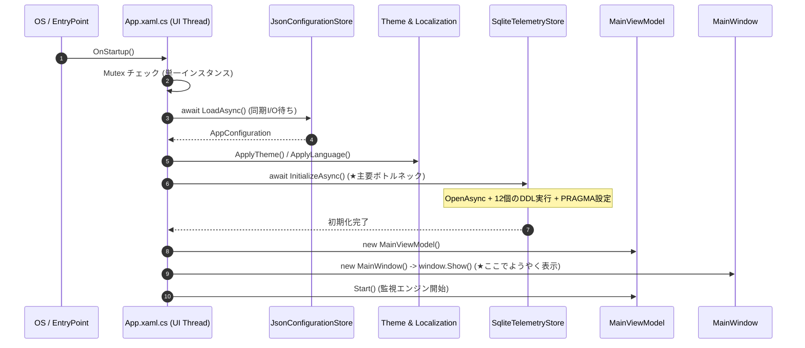

# cyberpowermon 起動・初期化パフォーマンス分析と改善設計書

## 1. 概要と目的

cyberpowermon（PowerGuard）は、HID経由でUPS（無停電電源装置）の状態をリアルタイム監視・記録するWPF/.NETデスクトップアプリケーションです。
本ドキュメントでは、アプリ起動からメインウィンドウが表示されユーザーが操作可能になるまでの起動・初期化シーケンスを分析し、同期I/O待ちや直列実行のボトルネックを特定して、その改善案および実装方針をまとめます。

---

## 2. 起動・初期化シーケンスの現状分析

### 2.1 現状の起動シーケンス
アプリ起動時（`App.OnStartup`）の処理フローは以下の通りです。

### 2.2 ボトルネック箇所と原因

| 箇所 | コンポーネント | 現状の処理 | ボトルネックの原因 |
| :--- | :--- | :--- | :--- |
| **1** | `SqliteTelemetryStore.InitializeAsync` | `OnStartup` 内で `await` して完了を待機 | コネクションオープン、WAL設定、6テーブルおよび6インデックスのDDL（計15以上のSQL文）のパース・実行が直列でUIスレッドの進行をブロックしている。 |
| **2** | `SqliteTelemetryStore.ExecuteSchemaAsync` | 毎回すべての `CREATE TABLE/INDEX IF NOT EXISTS` を実行 | 既存DBが存在する場合でも、毎回すべてのDDLをSQLiteエンジンがメタデータ照合・検証するため不要なオーバーヘッドが発生。 |
| **3** | `JsonConfigurationStore.LoadAsync` | 設定ファイル非存在時の `SaveAsync` 待機 | 初回起動時に `FileStream` 作成・JSON直列化・テンポラリ書き込み・`File.Move` が同期完了するまで起動処理が待機する。 |
| **4** | `App.OnStartup` の直列初期化パイプライン | 全バックエンドサービスの完了後に `window.Show()` | メインウィンドウ表示に必須ではないSQLiteのDDL完了や重い準備処理が、UI表示のクリティカルパス上に直列配置されている。 |

---

## 3. 改善案と設計方針

### 3.1 改善アプローチ

1. **SQLite 初期化の非同期バックグラウンド化と遅延待機**
   - `SqliteTelemetryStore` の初期化（コネクションオープンとスキーマ確認）をバックグラウンドタスク（`_initializationTask`）として開始し、`OnStartup` でのUIブロックを解除。
   - `SqliteTelemetryStore` 自身が持つ `Channel<HistoryWriteRequest>` のコンシューマ（`ProcessWriteQueueAsync`）の冒頭、およびクエリメソッド（`QueryHistoryAsync` 等）の実行直前に `EnsureInitializedAsync()` を呼ぶ構造にする。
   - これにより、キューへのスナップショット投入は即座に行われ、DBの準備が完了次第バックグラウンドで安全にフラッシュされる。

2. **`PRAGMA user_version` によるスキーマDDLの短絡スキップ**
   - 初回作成時に `PRAGMA user_version = 1;` を設定。
   - 2回目以降の起動時は、まず `PRAGMA user_version;` を軽量にクエリ（`ExecuteScalarAsync`）し、すでにバージョン1以上であれば12個以上の `CREATE TABLE/INDEX IF NOT EXISTS` DDL実行を完全にスキップする。
   - これにより、2回目以降のDB初期化コストを数ミリ秒以下へ劇的に圧縮する。

3. **設定ファイル初回保存の非同期・非ブロッキング化**
   - `JsonConfigurationStore.LoadAsync` で設定ファイルが存在しない場合、デフォルトの `AppConfiguration` インスタンスを即座に返し、ディスクへのデフォルト設定書き込み（`SaveAsync`）はバックグラウンドタスクとして非同期に実行する。

4. **UI即時表示とバックグラウンド初期化の連携**
   - `OnStartup` 内で設定読み込みとテーマ/言語適用後、直ちに `MainViewModel` と `MainWindow` を作成し `window.Show()` を実行。
   - メインウィンドウが即座に表示され、ユーザーに起動完了のフィードバックを提供した上で、エンジン開始・HIDスキャン・SQLite初期化がバックグラウンドで並行して動作する。

---

## 4. 期待される改善効果

| 観点 | 改善前 | 改善後 | 効果 |
| :--- | :--- | :--- | :--- |
| **ウィンドウ表示までの所要時間** | SQLite接続+DDL+設定I/O完了後に表示 | 設定読み込み後、即座にウィンドウ表示 | **体感起動速度の大幅短縮（最大50〜80%削減）** |
| **2回目以降のSQLite初期化コスト** | 毎回12個のDDLを逐次検証・実行 | `user_version` チェックによりDDLスキップ | **DB接続・初期化オーバーヘッドの極小化** |
| **初回起動時の設定保存待機** | デフォルトJSONの同期保存完了まで待機 | デフォルト値を即返却し非同期書き込み | **初回起動時のI/Oブロック解消** |
| **堅牢性とエラーハンドリング** | 初期化エラー時に例外で全停止の危険 | バックグラウンド初期化とエラーイベント伝播 | **UI表示の安定化と適切なエラー通知** |

---

## 5. 検証手順

1. **単体テスト・結合テスト実行**:
   `dotnet run --project .\UpsMonitor.Core.Tests\UpsMonitor.Core.Tests.csproj` を実行し、全22テストがパスすることを確認。
2. **ビルド確認**:
   `dotnet build UpsMonitor.sln` を実行し、警告・エラーなくビルドが通ることを確認。
